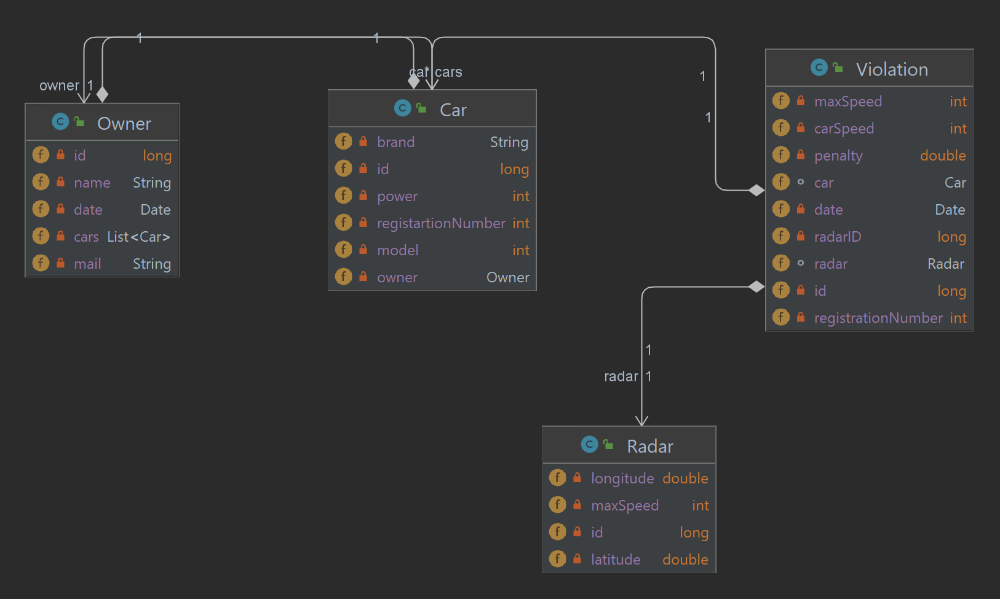
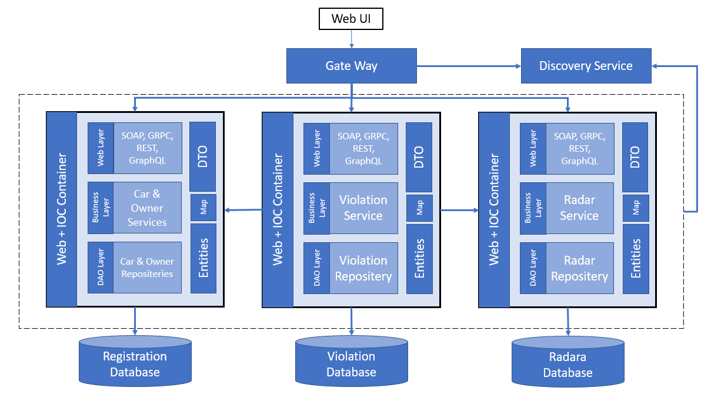
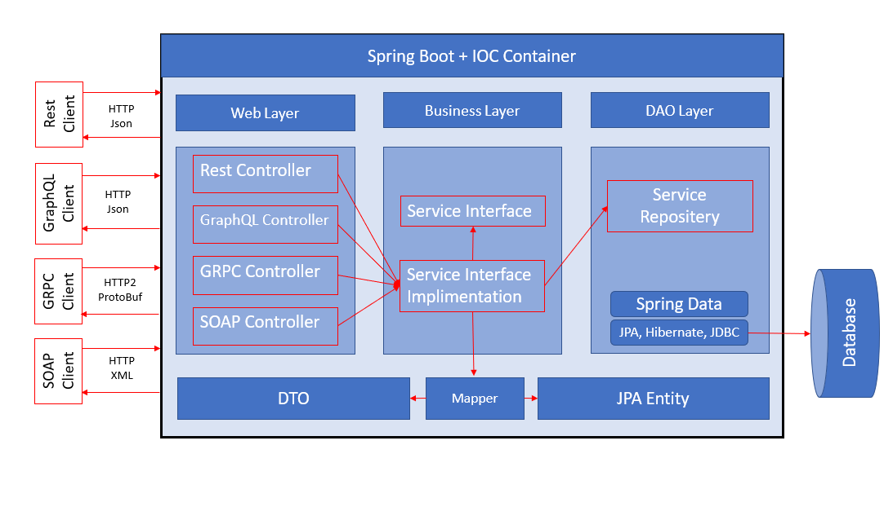
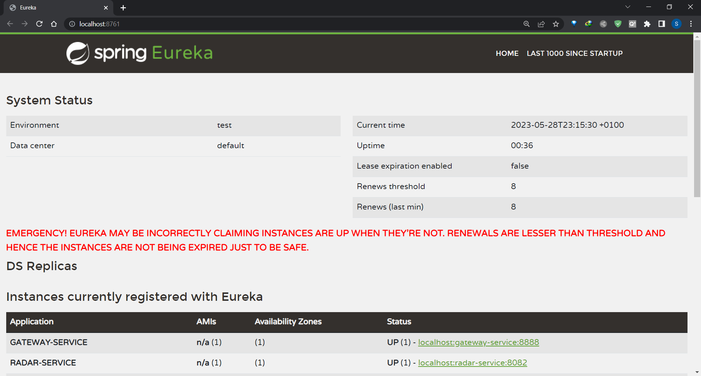
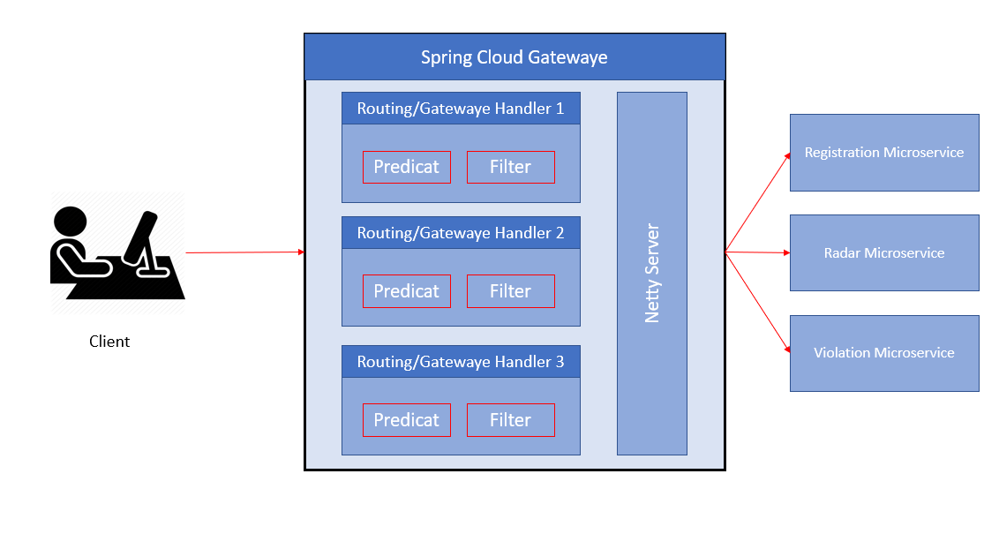
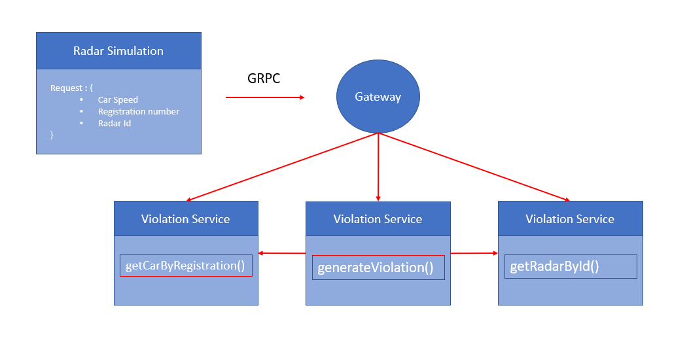
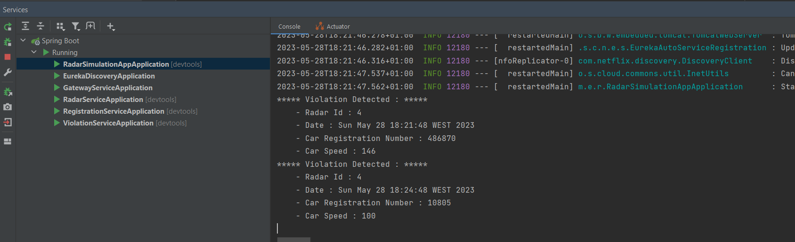

# Radar Management 

## Introduction

The aim of this project is to create a distributed system based on micro-services.This application allows to manage and automate the process of vehicle infractions following speed overruns detected by automatic radars. The system consists of three micro-services :
- Registration Service : allows to manage vehicles and their owners.
- Radar Service : allows to manage radars.
- Violation Service : manage the cars violations that detected by radars.

## Outils


```
- Spring Cloud
- Spring Data
- SOAP
- Eureka Discovery
- H2DataBase
- BloomRPC
```

## Class Diagram 
<table align="center">
  <tr></tr>
</table>

## Project Architecture
<table align="center">
  <tr></tr>
</table>

## Service Architecture
<table align="center">
  <tr></tr>
</table>

## Eureka Service 
<table align="center">
  <tr></tr>
</table>

## Gateway Service
<table align="center">
  <tr></tr>
</table>

## Regisration Service
<table align="center">
  <tr>
    <th>Rest</th>
    <th>SOAP</th>
   </tr>
  <tr>
    <td></td>
    <td></td>
  </tr>
    <th>GraphQL</th>
    <th>GRPC</th>
  <tr>
    <td></td>
    <td></td>
  </tr>
</table>

## Radar Service
<table align="center">
  <tr>
    <th>Rest</th>
    <th>SOAP</th>
   </tr>
  <tr>
    <td></td>
    <td></td>
  </tr>
    <th>GraphQL</th>
    <th>GRPC</th>
  <tr>
    <td></td>
    <td></td>
  </tr>
</table>

## Violation Service
<table align="center">
  <tr>
    <th>Rest</th>
    <th>SOAP</th>
   </tr>
  <tr>
    <td></td>
    <td></td>
  </tr>
    <th>GraphQL</th>
    <th>GRPC</th>
  <tr>
    <td></td>
    <td></td>
  </tr>
</table>


## Radar Simulation Application 
<table align="center">
  <tr>
    <td></td>
    <td></td>
  </tr>
</table>

